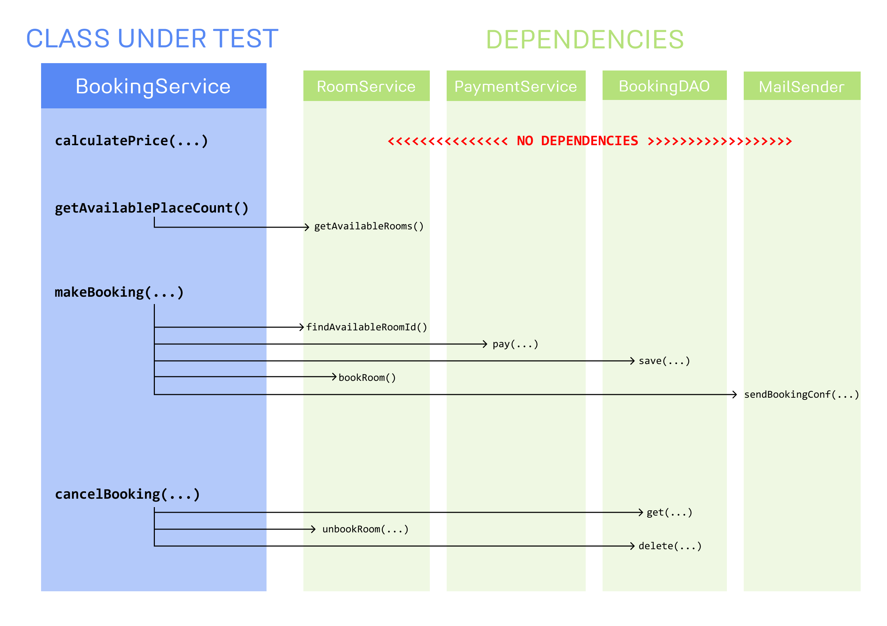

# Tests
JUnit, [Mockito](https://github.com/mockito/mockito/wiki/FAQ)

## Unit Tests
Are written for single software parts. Typically one unit test in Java verifies one class method.

## Mocking Frameworks
- Mockito
- JMockit
- EasyMock

## What should be mocked?

## Notations about test

Is a good practice annotate for any attribute if it is a @InjectMocks, @Mock, @Spy or @Captor

@Autowired provides control over where and how binding between beans should be performed. Can be used to in setter methods, in the constructor, in a _property_ or methods with arbitrary names and/or multiple arguments.

@MockBean to replace beans with mocked beans.

@Test to determine that the next _method_ is a test

@SpringBootTest to determine that this _class_ is a Class test of SpringBoot, the test with this annotation will take much longer to execute then a simple unit test. Is used to integration tests.

@SpyBean to create a spy bean instante

## What you will find in Mockito part 

### happyhotel(src\test\java\com\mockitotutorial\happyhotel\booking)

*Mockito 4 Basics:*
 - Default Return Values
 - Returning Custom Values
 - Multiple thenReturn calls
 - Throwing Exceptions
 - Mocking Void methods
 - Argument Matchers
 - Verifying Behavior
 - Spies

*Advanced mockito:*
 - Argument Captors
 - Mockito BDD
 - Mocking Static Methods
 - Mockito answers
 - Mocking Final

### SpringRestContrTestStudServices

Have tests in controller